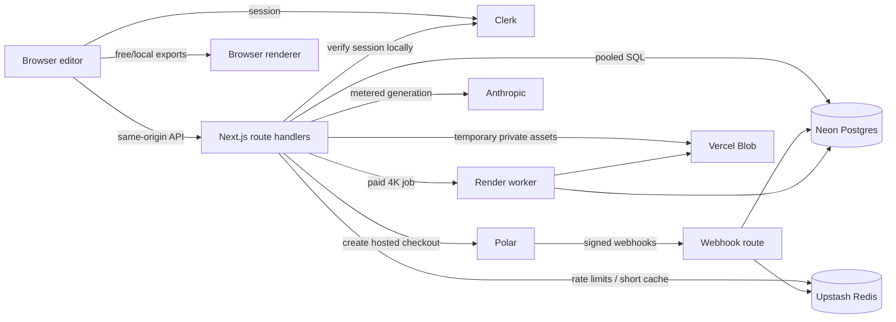

# Reframe authentication, billing, and entitlements

Status: proposed implementation design  
Last updated: 2026-09-16

## 1. Decision summary

Use the following stack for the first paid version of Reframe:

- **Authentication:** Clerk
- **Payments and tax:** Polar, using hosted Checkout and Customer Portal
- **Primary database:** Neon Postgres
- **Database access:** Drizzle ORM with `postgres.js`
- **Ephemeral counters and distributed rate limits:** Upstash Redis
- **Generated files and temporary render inputs:** private Vercel Blob
- **Hosting:** Vercel, with the database and Redis deployed in the same region

This preserves Reframe's local-first experience. A visitor can upload, preview, use presets, and try a small AI allowance without an account. Authentication is required only when the visitor buys something, saves durable state, or exceeds the anonymous allowance.

The product model is hybrid:

- Free anonymous trial
- Free signed-in account
- One-time 4K Export Pass
- Seven-day Project Pass
- Non-expiring AI credit packs
- Pro subscription
- Studio subscription later

Subscriptions and purchases are commercial concepts. **Entitlements and credit ledger entries are the application authority.** UI state, checkout redirects, Clerk metadata, and Polar API responses must never directly authorize a paid operation.

## 2. Why this stack

### Clerk

Clerk is a good fit because Reframe needs progressive authentication, not a custom authentication product. It provides mature Next.js session handling, OAuth and magic-link flows, account recovery, bot protection, and future organization support.

Clerk should own credentials and sessions. Reframe stores only Clerk's immutable user ID and the minimum profile data needed by the application. On every authenticated server request, the Clerk user ID is resolved to Reframe's internal UUID.

Do not put balances or authoritative plan state in Clerk public/private metadata. Metadata can lag, is awkward to transact against, and couples authorization to the identity provider.

### Polar

Polar is a strong initial payment choice because it is a Merchant of Record. It handles payment collection and global sales-tax/VAT obligations while supporting one-time products, subscriptions, credits, customer state, hosted checkout, and a customer portal.

Use Reframe's internal user UUID as Polar's immutable `external_customer_id`. Do not use an email address or Clerk user ID. That keeps billing stable if the authentication provider changes later.

### Neon Postgres

Neon Postgres is the recommended primary store:

- The data is relational and transaction-heavy: orders, subscriptions, grants, reservations, refunds, and an immutable ledger.
- Atomic row updates and unique constraints are essential to prevent double spending and duplicated webhook fulfillment.
- Neon provides pooled serverless connections and database branching without duplicating authentication functionality already supplied by Clerk.
- Standard Postgres avoids a proprietary data model and makes migration straightforward.

Supabase is also excellent, but its largest advantages here—Auth, browser Data APIs, and Storage—would overlap with Clerk and Vercel Blob. Choose Supabase instead only if Reframe intends to consolidate auth, database, realtime data, and storage into one vendor.

## 3. System boundaries



### Authority by concern

| Concern | Source of truth |
|---|---|
| Credentials and active session | Clerk |
| Product price and payment collection | Polar |
| Order/subscription event history | Polar, mirrored locally from verified webhooks |
| Current Reframe access | Local entitlement tables |
| AI balance | Local credit account + immutable credit ledger |
| Export pass consumption | Local export pass record |
| Temporary render artifacts | Vercel Blob, referenced by Postgres |
| Anonymous limits | Redis, backed by signed anonymous cookie and IP-derived key |

Polar and Clerk APIs are not called for every AI request or export. The request path uses the verified Clerk session plus a short local Postgres transaction.

## 4. Identity lifecycle

### Anonymous visitor

On the first metered action, issue a random 256-bit identifier in an `HttpOnly`, `Secure`, `SameSite=Lax` cookie. Store only an HMAC of that identifier in Redis. Rate-limit against both:

- anonymous-cookie key; and
- privacy-preserving HMAC of the normalized IP prefix.

The cookie is not authentication and grants only the small anonymous trial. Clearing it should not be enough to receive unlimited trials because the secondary rate limit remains.

### Signup and sign-in

Support Google Plus email verification/magic link initially. Add GitHub only if developer conversion data supports it. Avoid passwords unless customer demand appears.

On the first authenticated request:

1. Verify the Clerk session in the route handler.
2. Upsert `app_user` by `clerk_user_id`.
3. Create the zero-balance credit accounts if they do not exist.
4. Grant the current free-account allowance once using an idempotency key.
5. Optionally mark the anonymous trial as claimed; do not blindly transfer renewable anonymous allowance.

Clerk webhooks synchronize profile changes and deletion status, but the first request must use a lazy upsert because webhook delivery is asynchronous.

### Account deletion

Soft-delete the local user immediately, revoke active sessions through Clerk, and queue deletion/anonymization of non-financial personal data. Keep the minimum financial records legally required for accounting, refunds, and fraud defense. Ledger and order rows should reference the retained pseudonymous internal UUID rather than copied email addresses.

## 5. Product and entitlement model

Suggested Polar products:

| Product key | Billing type | Fulfillment |
|---|---|---|
| `export_4k_single` | one-time | One 4K export pass, re-renders for the bound project for 24 hours |
| `project_pass_7d` | one-time | One project scope for seven days + 20 AI credits |
| `ai_credits_25` | one-time | 25 non-expiring AI credits |
| `pro_monthly` | recurring | Pro features + 300 monthly AI credits |
| `pro_yearly` | recurring | Pro features + monthly credit grants, not all credits upfront |
| `studio_monthly` | recurring, later | Studio features + larger allowance |

Keep price data in Polar. The local `billing_product` table maps trusted Polar product IDs to fulfillment recipes; a client may submit a product key but never an amount or a grant quantity.

### Feature keys

Use stable feature keys in code and grants:

- `export.standard.unlimited`
- `export.4k`
- `export.transparent`
- `export.lottie`
- `share.permanent`
- `share.private`
- `project.history`
- `render.priority`

Do not encode plan names directly into checks such as `if (plan === "pro")`. Ask the entitlement service for a feature. This permits promotional grants and future packaging changes without rewriting the product.

### Credits versus entitlements

- **AI prompts** consume `ai_generation` credits.
- **Single 4K purchase** grants an `export_pass`, not generic currency.
- **Project Pass** grants a scoped, time-limited entitlement plus AI credits.
- **Subscriptions** grant features for a billing period and add a monthly credit ledger entry.

This keeps the customer-facing model understandable while retaining a unified internal accounting system.

## 6. Payment flows

### Checkout creation

`POST /api/billing/checkout`

1. Require a valid Clerk session. If the editor is anonymous, preserve its local draft and start Clerk's sign-in flow first.
2. Resolve the internal user UUID.
3. Validate the requested product key against the server-side catalog.
4. Create a `checkout_intent` with a random UUID and status `pending`.
5. Create the Polar checkout on the server with:
   - the mapped Polar product ID;
   - `external_customer_id = app_user.id`;
   - metadata containing only `checkout_intent_id` and `product_key`;
   - an allowlisted success URL.
6. Store the returned Polar checkout ID and redirect URL.
7. Return only the hosted checkout URL.

Never accept a price, currency, grant size, success URL, or Polar product ID directly from the browser.

### Webhook fulfillment

`POST /api/webhooks/polar`

1. Read the unmodified request body and verify Polar's signature before parsing or logging it.
2. Insert the provider event ID into `webhook_event`. A unique constraint makes retries safe.
3. Persist the verified payload in the webhook inbox. If the event is already `processed`, acknowledge it; otherwise lock the existing inbox row and continue processing.
4. In one database transaction:
   - validate the product against `billing_product`;
   - upsert the billing customer/order/subscription mirror;
   - create entitlement or credit ledger entries with unique idempotency keys;
   - update the materialized balance/snapshot;
   - mark the event processed.
5. Invalidate the user's Redis entitlement cache.
6. Return `2xx` only when durable processing succeeds. On failure, mark the inbox row `failed` in a separate recovery transaction and return `5xx` so Polar retries.

Retain verified webhook payloads for a limited operational window (for example, 90 days), then redact the payload while retaining the event ID, type, hash, timestamps, and processing result for audit purposes.

The checkout success page does not grant access. It polls `GET /api/me/access` until the verified webhook has committed, then updates the editor. A server-side reconciliation endpoint may query Polar Customer State to repair an unusually delayed webhook, but this is a recovery path rather than the normal authorization path.

### Refunds, disputes, and subscription changes

- Refund: revoke unused passes and subtract the remaining amount from the specific purchased credit grant through compensating ledger entries.
- Credits already consumed: never force the spendable account below zero. Record how much could not be recovered, place a billing-risk hold when appropriate, and flag it for review; never rewrite ledger history.
- Subscription cancellation: retain access through `current_period_end`.
- Past due: use a short grace period, then revoke renewable features while preserving purchased credits.
- Chargeback: immediately revoke unused grants, block new paid consumption, and send the account to review.

## 7. Metered AI flow

`POST /api/ai-animate` becomes a transactional metered route:

1. Apply distributed guest/user/IP rate limits.
2. Authenticate if present and resolve the local account.
3. For a guest, atomically consume the Redis trial counter.
4. For a user, atomically reserve one `ai_generation` credit:
   - lock the `credit_account` row and reject if `available < 1`;
   - select the eligible `credit_grant` bucket with the earliest expiry, placing non-expiring purchased credits last;
   - decrement that bucket's `remaining` amount;
   - `UPDATE credit_account SET available = available - 1, reserved = reserved + 1 ...`;
   - insert a uniquely keyed `usage_operation` and ledger record in the same transaction.
5. Call Anthropic.
6. On success, move the unit from `reserved` to consumed and record provider token/cost metadata.
7. On failure or invalid generated plan, release the reservation and append a refund/release ledger entry.

The client supplies an idempotency key for each button submission. Repeated requests with the same key return the original result or status rather than charging again.

If the process dies after reservation, a scheduled reconciliation job releases reservations older than the maximum generation timeout unless a completed operation exists.

Free and subscription allowances are separate expiring grant buckets. Purchased credit packs are non-expiring buckets. A scheduled job creates free/monthly subscription grants using deterministic idempotency keys such as `monthly:{subscriptionId}:{yyyy-mm}`. Annual subscribers still receive credits monthly instead of receiving the entire annual allowance upfront.

## 8. 4K export security

The existing renderer runs in the browser. Any premium check shipped entirely to the browser is a **soft paywall**: a technical user can modify JavaScript or call internal functions directly.

Use two phases:

### Phase A: launch quickly

- Keep standard-resolution rendering local.
- Check the paid pass through a server endpoint before enabling 4K in the UI.
- Record pass consumption server-side.
- Accept that this deters normal misuse but is not strong enforcement.

### Phase B: enforce the product

- Move paid 4K rendering to an isolated server worker.
- The browser uploads the already-sanitized SVG plus validated animation plan to a private, short-TTL Blob path.
- The API binds an unused export pass to a source-SVG fingerprint on the first render.
- Re-renders of that same source fingerprint are allowed for 24 hours.
- The worker has no public ingress, uses fixed render limits, blocks networking, and produces a private output Blob with a short-lived download URL.
- Delete inputs and outputs automatically after 24 hours unless the user explicitly saves the project.

Use a server HMAC over the normalized source SVG hash when binding a pass. Never treat a browser-provided filename as project identity.

## 9. Performance design

### Hot-path goals

| Operation | Target before external work |
|---|---:|
| Verify signed-in request | under 20 ms typical at the application edge/region |
| Entitlement read | one indexed lookup; cacheable for 30–60 seconds |
| Credit reservation | one short Postgres transaction |
| Checkout start | one local insert plus Polar API call |

### Rules

- Deploy Vercel functions, Neon, and Upstash in the same primary region.
- Use Neon's pooled connection string for runtime and direct connection string only for migrations.
- Initialize one database client at module scope with a very small serverless pool.
- Never call Clerk's Backend API, Polar Customer State, or Polar Checkout API during ordinary entitlement checks.
- Keep `account_access_snapshot` denormalized for fast UI reads; billing webhooks update it transactionally and invalidate Redis.
- Do not cache credit consumption decisions. Redis may cache feature access, but the Postgres atomic update decides whether spendable balance exists.
- Keep SVG data out of Postgres. Store only hashes, byte sizes, ownership metadata, and private Blob keys.
- Partition or archive `webhook_event`, `credit_ledger`, and `audit_event` when volume justifies it; do not optimize prematurely.

## 10. Security controls

### Authentication and authorization

- Verify Clerk authentication inside every protected Route Handler and Server Action. Proxy/middleware is useful for redirects, not sufficient authorization.
- Use Reframe's internal UUID in all domain tables. Never authorize by email.
- Require recent authentication before changing billing identity or opening sensitive account-management actions.
- Start without organizations. Add Clerk Organizations only when team billing exists.

### Payment and webhook security

- Use Polar-hosted checkout; Reframe never receives card details, reducing PCI scope.
- Verify webhook signatures against the raw body and reject stale timestamps.
- Deduplicate by provider event ID and make every fulfillment operation idempotent.
- Do not grant access from the success URL, browser state, Clerk metadata, or unsigned webhook JSON.
- Use separate Polar sandbox/production organizations, products, tokens, and webhook secrets.
- Rotate secrets and scope provider tokens to the minimum required permissions.

### API security

- Replace all in-memory rate-limit maps with Upstash Redis sliding-window limits.
- Rate-limit by user, anonymous cookie, IP prefix, route, and cost tier.
- Enforce same-origin mutation requests and CSRF protections in addition to authentication.
- Validate all bodies with Zod; apply explicit byte, layer, duration, frame-count, and render-time limits.
- Use opaque, random object IDs. Prevent sequential identifier enumeration.
- Add `Cache-Control: no-store` to access, balance, checkout, portal, and webhook responses.
- Keep webhook endpoints excluded from Clerk protection but protected by provider signatures.

### Data and privacy

- Store no raw SVG for ordinary editing or AI prompting beyond the request lifetime.
- Store private render inputs only with explicit TTL and deletion jobs.
- Minimize copied Clerk/Polar PII. Prefer provider IDs and internal UUIDs.
- Encrypt transport, rely on managed encryption at rest, and place all secrets in Vercel environment storage.
- Redact cookies, authorization headers, webhook bodies, SVGs, prompts, and email addresses from logs.
- Maintain an audit trail for grants, debits, refunds, admin changes, and render downloads.

### Abuse and financial safety

- Set global daily AI and rendering budgets with automatic circuit breakers.
- Add per-account velocity limits even when credits are available.
- Bound concurrent render jobs per user.
- Reject SVG external references and worker network access to prevent SSRF.
- Monitor webhook failure rate, duplicate rate, negative balances, refund-after-consumption, and chargebacks.

## 11. Next.js integration notes

The project uses Next.js 16. The installed framework documentation marks `middleware.ts` as deprecated in favor of `proxy.ts`. When Clerk is implemented, migrate the existing security-header middleware to `proxy.ts` and compose it with `clerkMiddleware()`.

Proxy should provide optimistic redirects and shared headers only. Route Handlers remain public HTTP endpoints, so each paid endpoint must perform its own authentication and authorization check.

Proposed routes:

```text
src/app/api/me/access/route.ts
src/app/api/billing/checkout/route.ts
src/app/api/billing/portal/route.ts
src/app/api/billing/reconcile/route.ts
src/app/api/webhooks/clerk/route.ts
src/app/api/webhooks/polar/route.ts
src/app/api/credits/route.ts
src/app/api/render/route.ts
src/app/api/render/[jobId]/route.ts
```

Proposed server modules:

```text
src/lib/auth/current-user.ts
src/lib/billing/catalog.ts
src/lib/billing/entitlements.ts
src/lib/billing/fulfillment.ts
src/lib/billing/credits.ts
src/lib/billing/polar.ts
src/lib/db/client.ts
src/lib/db/schema.ts
src/lib/rate-limit.ts
src/lib/render/jobs.ts
```

## 12. Observability and recovery

Record metrics for:

- checkout started/completed/abandoned;
- webhook lag and processing failures;
- credit grants, reservations, releases, and consumption;
- AI cost per account and gross margin by product;
- render queue duration, failures, output size, and download completion;
- entitlement-cache hit rate;
- refund and chargeback rates.

Create admin-only repair commands that can:

- replay an already verified webhook by event ID;
- reconcile a user from Polar Customer State;
- rebuild a credit balance from the immutable ledger;
- rebuild an access snapshot from active grants;
- release stale usage reservations.

All repair commands append audit events. They never directly overwrite ledger history.

## 13. Implementation sequence

1. Provision Neon and add Drizzle migrations for the proposed schema.
2. Add Clerk with progressive sign-in and lazy local-user creation.
3. Replace in-memory API rate limits with Upstash Redis.
4. Implement the credit service and meter `/api/ai-animate`.
5. Configure Polar sandbox products and server-side checkout creation.
6. Implement the idempotent Polar webhook inbox and fulfillment service.
7. Add access/balance APIs and customer portal.
8. Launch AI packs and Pro subscription.
9. Launch the 4K Export and Project Pass with soft client enforcement.
10. Move 4K export to the isolated render worker before marketing it as strongly protected.
11. Add reconciliation jobs, operational dashboards, security tests, and incident runbooks.

## 14. Platform alternatives

### Authentication

| Platform | When it is better | Tradeoff |
|---|---|---|
| Clerk | Best default for Reframe: fastest polished progressive auth and future organizations | Vendor cost and dependency |
| Better Auth | Best if open-source control and direct database ownership are more important; Polar has a dedicated integration | More security and authentication operations owned by Reframe |
| Supabase Auth | Best if consolidating on the full Supabase platform | Less reason to use it alongside Neon and Clerk |

Recommendation: **keep Clerk for launch**. Better Auth is the strongest alternative if cost or vendor independence becomes a material concern, but changing now would add work without improving the customer proposition.

### Payments

| Platform | When it is better | Tradeoff |
|---|---|---|
| Polar | Best default for an early global AI product; MoR plus subscriptions, one-time sales, credits, and metering | Higher fee than direct processing and less low-level flexibility |
| Stripe Billing | Best at scale when Reframe wants maximum control and can own tax registration/remittance or add tax tooling | Reframe remains merchant and owns more compliance work |
| Paddle | Strong mature MoR option for larger SaaS operations and global payment optimization | Typically heavier commercial/onboarding experience and higher published base fee |
| Lemon Squeezy | Simple creator-oriented MoR alternative | Evaluate API depth and usage-credit fit before choosing it over Polar |
| Clerk Billing | Very tight Clerk UI integration | Stripe-only, USD-only at present, not a Merchant of Record, and less suitable for one-time credit products |

Recommendation: **use Polar now**. Re-evaluate direct Stripe only after payment volume makes the fee difference larger than the operational cost of tax and billing compliance.

## 15. Go-live acceptance criteria

- A repeated Polar webhook cannot duplicate credits, passes, orders, or subscriptions.
- A repeated AI request with the same idempotency key cannot charge twice.
- Two concurrent requests cannot spend the last credit twice.
- A failed or timed-out AI call returns its reservation.
- Checkout success without a verified paid webhook grants nothing.
- Refunded unspent credits and passes are revoked through compensating records.
- A signed-in request can authorize without a Clerk Backend API or Polar API round trip.
- All paid endpoints reject missing sessions, cross-origin mutation attempts, invalid inputs, and over-limit payloads.
- Webhook bodies, prompts, SVG content, secrets, and payment PII do not appear in application logs.
- Production and sandbox credentials and product IDs cannot be mixed.
- Database restore, ledger rebuild, webhook replay, and stale-reservation recovery have been tested.

## 16. Primary references

- [Polar Next.js adapter](https://polar.sh/docs/integrate/sdk/adapters/nextjs)
- [Polar Checkout API and external customer IDs](https://polar.sh/docs/features/checkout/session)
- [Polar Customer State](https://polar.sh/docs/integrate/customer-state)
- [Polar webhook events](https://polar.sh/docs/integrate/webhooks/events)
- [Polar Merchant of Record model](https://polar.sh/docs/merchant-of-record/introduction)
- [Clerk Next.js SDK](https://clerk.com/docs/reference/nextjs/overview)
- [Clerk webhook synchronization](https://clerk.com/docs/guides/development/webhooks/syncing)
- [Neon connection pooling](https://neon.com/docs/connect/connection-pooling)
- [Supabase database security](https://supabase.com/docs/guides/database/secure-data)
